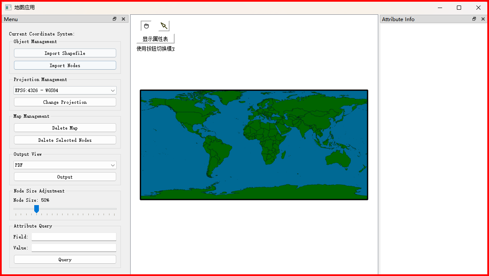

# 软件运行与测试结果.md

## 1. 引言
**测试目的**：确保 PyGISS-2024 版本所有功能能够按预期正常工作，界面与操作符合用户使用习惯。  
**测试环境说明**：测试在 Microsoft Windows 11 家庭中文版（版本：10.0.22631）上进行，Python 版本为 3.11.0。所有依赖库已安装，并配置了虚拟环境。

## 2. 测试用例设计
### 2.1 功能测试
#### 2.1.1 属性查询与显示测试
- **测试目的**：验证属性查询功能的准确性，以及属性表显示的完整性。
- **测试步骤**：
  1. 启动程序，导入包含属性数据的 Shapefile 文件。
  2. 在“属性查询”区域，输入特定属性字段（如“NAME”）和对应的值（如“France”）。
  3. 点击“查询”按钮，观察属性信息窗口中是否显示符合条件的要素属性。
  4. 打开属性表，确认所有要素的属性完整、无乱码。
- **预期结果**：
  - 属性信息窗口与查询条件一致，显示正确的属性数据。
  - 属性表完整显示所有要素的属性，无乱码或缺失。
  

#### 2.1.2 地图导出功能测试
- **测试目的**：验证地图导出功能，确保支持 PNG、JPEG 和 PDF 格式，且导出内容正确。
- **测试步骤**：
  1. 导入地图数据并调整视图至适当位置。
  2. 依次选择 PNG、JPEG 和 PDF 格式导出，保存到本地。
  3. 打开导出的文件，检查内容是否与显示一致。
- **预期结果**：
  - 导出过程顺利，无错误提示。
  - 导出的文件能够正常打开，地图内容完整、清晰。

#### 2.1.3 节点显示尺寸调整测试
- **测试目的**：验证节点尺寸调整功能是否正常工作。
- **测试步骤**：
  1. 导入节点数据，确保节点在地图上正常显示。
  2. 使用滑动条调整节点尺寸，从最小值逐步滑动到最大值，观察节点显示变化。
- **预期结果**：
  - 节点尺寸随滑动条变化调整，响应灵敏。
  - 节点在不同尺寸下显示清晰。

#### 2.1.4 地图数据的投影转换测试
- **测试目的**：验证地图数据在不同投影下显示的准确性。
- **测试步骤**：
  1. 导入 Shapefile 文件，并设置为初始投影（如 EPSG:4326）。
  2. 在“投影管理”区域选择不同的投影（如 EPSG:3571、EPSG:3035），点击转换。
  3. 每次转换后，观察地图的形状和位置变化。
- **预期结果**：
  - 地图正确显示不同投影效果，符合投影特性。

#### 2.1.5 节点管理功能测试
- **测试目的**：验证节点导入、显示和删除功能。
- **测试步骤**：
  1. 导入节点数据，检查节点是否正常显示在地图上。
  2. 选择并删除部分节点。
  3. 确认被删除的节点从地图上消失。
- **预期结果**：
  - 节点数据成功导入，位置准确。
  - 被删除的节点从地图上移除，其他节点正常显示。

#### 2.1.6 图层管理功能测试
- **测试目的**：验证单个图层的导入和清除功能。
- **测试步骤**：
  1. 导入一个 Shapefile 文件图层。
  2. 使用“清除图层”功能，清除特定图层，观察地图变化。
  3. 重新加载已清除的图层，确保图层正常显示。
- **预期结果**：
  - 图层能够成功导入和显示。
  - 清除操作正确执行，地图上不再显示已清除的图层。
  - 重新导入的图层能够正常显示。

### 2.2 测试代码
以下是针对 PyGISS-2024 的测试代码文件：
- `test_integration.py`: 整体功能集成测试，验证系统各模块的协同工作。
- `test_mapData.py`: 测试地图数据处理模块，确保数据正确读取和显示。
- `test_nodeData.py`: 测试节点数据的管理和显示功能。
- `test_UI.py`: 测试用户界面的各项功能，确保用户交互体验良好。

## 3. 测试结果记录
在测试过程中，所有步骤按预期执行。以下是主要测试结果和截图总结：
- 属性查询与显示测试：成功，查询功能准确，属性表完整显示。
- 地图导出功能测试：成功，导出的 PNG、JPEG 和 PDF 文件内容清晰。
- 节点显示尺寸调整测试：成功，节点显示随滑动条调整灵活响应。
- 地图数据的投影转换测试：成功，不同投影转换显示正确。
- 节点管理功能测试：成功，节点操作准确。
- 图层管理功能测试：成功，图层管理功能稳定。

## 4. 测试总结
- **测试结论**：所有功能均已通过测试，运行稳定，符合需求。
- **发现的问题及改进建议**：
  - 测试过程中未发现严重问题。
  - 建议在未来版本中增加数据输入验证及错误反馈机制，以进一步增强系统的可靠性和用户体验。
